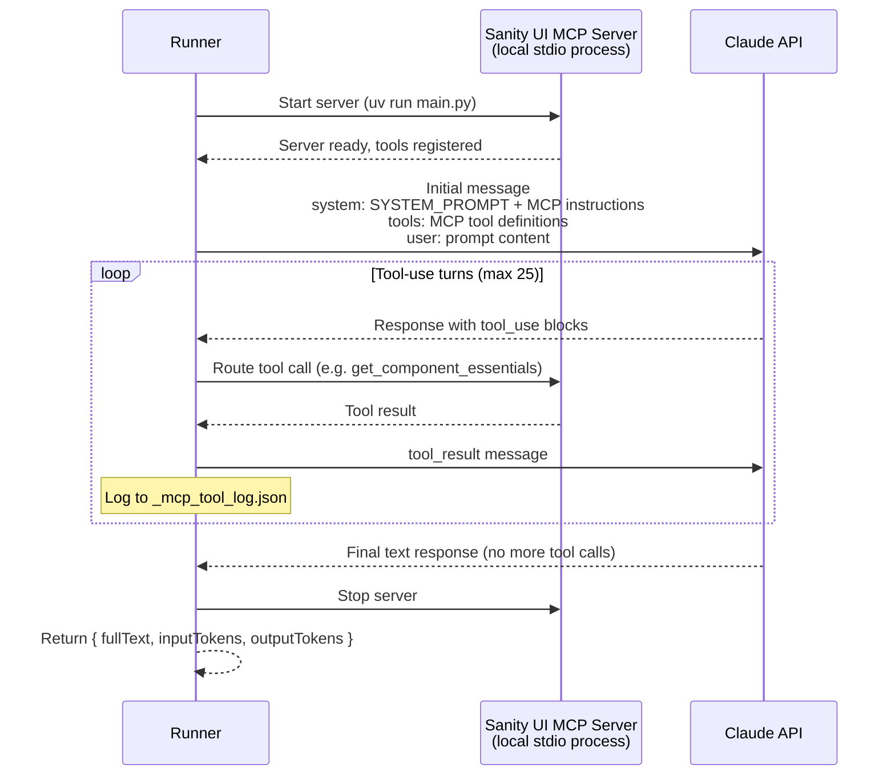
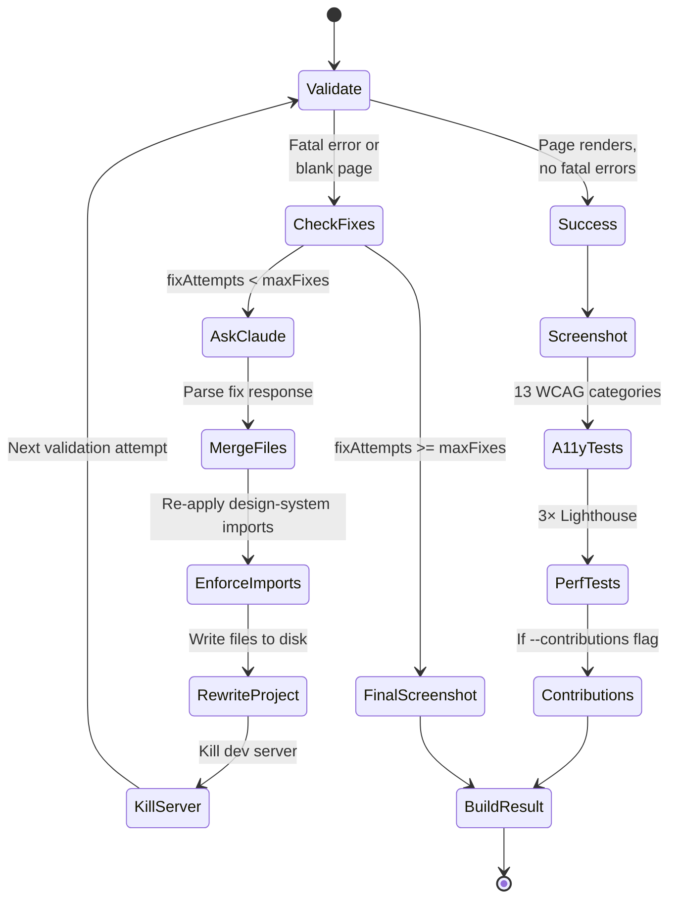
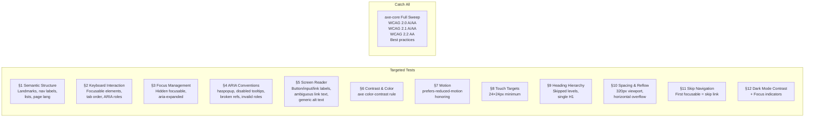

# Agent Tester — Architecture Diagram

## High-Level Flow

```mermaid
flowchart TD
    START([node src/index.js]) --> PARSE_CLI[Parse CLI flags]
    PARSE_CLI --> VALIDATE[Validate arguments]
    VALIDATE --> SELECT_RUNNER{Runner type?}
    SELECT_RUNNER -->|--runner api| IMPORT_API[Import runner.js<br/>Anthropic SDK]
    SELECT_RUNNER -->|--runner cli| IMPORT_CLI[Import runner-cli.js<br/>Claude CLI]
    IMPORT_API --> RESOLVE_PROMPTS
    IMPORT_CLI --> RESOLVE_PROMPTS

    RESOLVE_PROMPTS[Resolve prompt files] --> MCP_CHECK{MCP enabled?<br/>no --no-mcp}
    MCP_CHECK -->|Yes| SWAP_PROMPT[Swap training prompt<br/>→ PROMPT-WITH-TRAINING-MCP.md]
    MCP_CHECK -->|No| KEEP_PROMPT[Keep PROMPT-WITH-TRAINING.md]
    SWAP_PROMPT --> RESOLVE_BRIEF
    KEEP_PROMPT --> RESOLVE_BRIEF

    RESOLVE_BRIEF{--agent-prompt?} -->|Yes| GEN_BRIEF[Call Claude to generate<br/>PRD-style interface brief]
    RESOLVE_BRIEF -->|No| STATIC_BRIEF[Use static fallback brief]
    GEN_BRIEF --> INJECT
    STATIC_BRIEF --> INJECT

    INJECT[Inject brief into prompt template<br/>Replace ADD PROMPT HERE placeholder] --> CREATE_RUN_DIR

    CREATE_RUN_DIR[Create output/YYYY-MM-DD/HH.MM/] --> PROMPT_LOOP

    subgraph PROMPT_LOOP [For each prompt key: control, training]
        LOAD_PROMPT[Load prompt .md file<br/>Inject brief] --> CREATE_PROMPT_DIR[Create prompt output dir]
        CREATE_PROMPT_DIR --> ITER_QUEUE[Build iteration queue<br/>1..N iterations]
        ITER_QUEUE --> CONCURRENCY[Process queue with<br/>bounded concurrency]
        CONCURRENCY --> RUN_AGENT[[runAgent per iteration<br/>See detailed flow below]]
        RUN_AGENT --> COLLECT[Collect results array]
    end

    COLLECT --> VIS_DIFF{≥2 screenshots?}
    VIS_DIFF -->|Yes| COMPUTE_DIFF[Compute pairwise<br/>visual diffs]
    VIS_DIFF -->|No| SKIP_DIFF[Skip visual diff]
    COMPUTE_DIFF --> REPORT
    SKIP_DIFF --> REPORT

    REPORT[Generate report.json + report.md] --> DONE([Done])
```



## Detailed: runAgent per Iteration

```mermaid
flowchart TD
    ENTRY([runAgent called]) --> SAVE_PROMPT[Save _prompt.txt]
    SAVE_PROMPT --> INIT_LOG[Initialize _agent_log.txt]

    INIT_LOG --> GEN_LOOP{Generation attempt<br/>≤ maxRetries?}

    subgraph STEP1 [Step 1: Initial Generation]
        GEN_LOOP -->|Yes| MCP_DETECT{Prompt mentions<br/>MCP?}
        MCP_DETECT -->|Yes| GEN_MCP[generateWithMcp<br/>Multi-turn tool use<br/>via Sanity UI MCP server]
        MCP_DETECT -->|No| GEN_SIMPLE[generateSimple<br/>Single API call]

        GEN_MCP --> SAVE_RAW[Save _raw_response.txt<br/>Append to _agent_log.txt]
        GEN_SIMPLE --> SAVE_RAW

        SAVE_RAW --> PARSE_FILES[parseFiles from response<br/>Extract ---FILE: blocks]
        PARSE_FILES --> HAS_FILES{Files parsed?}
        HAS_FILES -->|No| GEN_LOOP
        HAS_FILES -->|Yes| PARSE_FEEDBACK[parseFeedback<br/>Extract ---FEEDBACK--- block]
    end

    GEN_LOOP -->|Exhausted| THROW_ERR([Throw: no files produced])

    PARSE_FEEDBACK --> SAVE_FEEDBACK[Save _feedback.json]
    SAVE_FEEDBACK --> WRITE_PROJECT[writeProjectFiles to<br/>iteration/project/]

    WRITE_PROJECT --> ENFORCE_CHECK{Prompt references<br/>@sanity-labs/design-system?}
    ENFORCE_CHECK -->|Yes| ENFORCE[enforceUiPocImports<br/>• Add pkg to package.json<br/>• Upgrade React to ^19.2<br/>• Rewrite imports from @sanity/ui<br/>• Inject styles.css import]
    ENFORCE_CHECK -->|No| SKIP_ENFORCE[Skip enforcement]
    ENFORCE -->|Modified| REWRITE[Rewrite project files]
    ENFORCE -->|No changes| LINT
    SKIP_ENFORCE --> LINT
    REWRITE --> LINT

    LINT[Lint project files<br/>Sanity UI ESLint rules] --> FIX_LOOP_START

    subgraph STEP2 [Step 2: Validate → Fix Loop]
        FIX_LOOP_START{fixAttempts ≤<br/>maxFixes?} -->|Yes| VALIDATE_PROJ[validateProject]

        subgraph VALIDATE [validateProject - screenshot.js]
            direction TB
            NPM_INSTALL[npm install --legacy-peer-deps<br/>Append to _npm_install.txt] --> START_DEV[Start Vite dev server<br/>npm run dev --port 0]
            START_DEV --> WAIT_URL[Wait for server URL<br/>from stdout]
            WAIT_URL --> CHECK_PAGE[Open page in Puppeteer<br/>Check for console errors<br/>Check for rendered content]
            CHECK_PAGE --> CLASSIFY{Fatal errors?<br/>Content rendered?}
        end

        VALIDATE_PROJ --> SUCCESS{Validation<br/>succeeded?}

        SUCCESS -->|Yes| SCREENSHOT[captureScreenshot<br/>Save screenshot.png]
        SUCCESS -->|No, fixable| FIX_INC[fixAttempts++]

        FIX_INC --> LOG_FIX_PROMPT[Build fix prompt with:<br/>• Current project files<br/>• Console errors<br/>• Fatal error message<br/><br/>Append to _agent_log.txt]
        LOG_FIX_PROMPT --> CALL_FIX[Call Claude with<br/>FIX_SYSTEM_PROMPT<br/>+ fix prompt]
        CALL_FIX --> SAVE_FIX[Save _fix_response_N.txt<br/>Append to _agent_log.txt]
        SAVE_FIX --> PARSE_FIX[Parse fixed files<br/>Merge into project]
        PARSE_FIX --> RE_ENFORCE{Design system<br/>enforcement?}
        RE_ENFORCE -->|Yes| ENFORCE_AGAIN[Re-apply enforceUiPocImports<br/>Log to _agent_log.txt]
        RE_ENFORCE -->|No| WRITE_FIX
        ENFORCE_AGAIN --> WRITE_FIX[Rewrite project files]
        WRITE_FIX --> KILL_DEV[Kill dev server]
        KILL_DEV --> FIX_LOOP_START

        FIX_LOOP_START -->|Exhausted| LAST_SCREENSHOT[Take screenshot of<br/>final broken state]
    end

    SCREENSHOT --> MEASURE

    subgraph STEP2B [Step 2b: Measurement]
        MEASURE[Measurements against live dev server] --> A11Y[runAccessibilityTests<br/>13 WCAG test categories<br/>+ axe-core full sweep]
        A11Y --> PERF[measurePerformance<br/>3× Lighthouse runs<br/>+ React profiling]
    end

    PERF --> CONTRIB_CHECK

    subgraph STEP3 [Step 3: Contributions - optional]
        CONTRIB_CHECK{--contributions<br/>AND feedback?} -->|Yes| GEN_CONTRIB[Call Claude with<br/>CONTRIBUTION_SYSTEM_PROMPT<br/>+ feedback items]
        CONTRIB_CHECK -->|No| SKIP_CONTRIB[Skip]

        GEN_CONTRIB --> PARSE_CONTRIB[Parse contribution files<br/>Parse ---CHALLENGES--- block]
        PARSE_CONTRIB --> WRITE_CONTRIB[Write to contributions/<br/>• _raw_response.txt<br/>• feedback.json<br/>• feedback.md<br/>• contribution files]
    end

    WRITE_CONTRIB --> BUILD_RESULT
    SKIP_CONTRIB --> BUILD_RESULT
    LAST_SCREENSHOT --> BUILD_RESULT

    BUILD_RESULT[buildResult<br/>• Compute LoC, component usage<br/>• Extract inline styles + properties<br/>• Save _meta.json] --> RETURN([Return iteration result])
```



## MCP Tool-Use Flow (generateWithMcp)



## Validate → Fix Loop Detail



## Accessibility Test Categories (13 tests)



## Output Directory Structure

```
output/
└── YYYY-MM-DD/                          ← Date directory
    └── HH.MM/                           ← Run directory (timestamp)
        ├── report.json                  ← Machine-readable report
        ├── report.md                    ← Human-readable Markdown report
        ├── control/                     ← Control prompt results
        │   ├── diff_iter1_vs_iter2.png
        │   ├── iteration-1/
        │   │   ├── project/             ← Generated + fixed project files
        │   │   ├── screenshot.png
        │   │   ├── _raw_response.txt    ← Initial Claude response
        │   │   ├── _agent_log.txt       ← Full agent conversation log
        │   │   ├── _feedback.json       ← Parsed feedback items
        │   │   ├── _fix_response_1.txt  ← Fix responses (if needed)
        │   │   ├── _npm_install.txt     ← npm install logs (all attempts)
        │   │   ├── _console_errors.txt  ← Browser console errors
        │   │   ├── _meta.json           ← Metrics, fix log, results
        │   │   ├── _a11y_results.json   ← 13 accessibility test results
        │   │   ├── _perf_results.json   ← Lighthouse + React profiling
        │   │   ├── _prompt.txt          ← Resolved prompt sent to agent
        │   │   └── contributions/       ← If --contributions enabled
        │   │       ├── _raw_response.txt
        │   │       ├── feedback.json
        │   │       ├── feedback.md
        │   │       └── (contribution files)
        │   └── iteration-2/
        │       └── ...
        └── training/                    ← Training prompt results
            ├── iteration-1/
            │   ├── ...                  ← Same structure as control
            │   └── _mcp_tool_log.json   ← MCP tool calls (if MCP enabled)
            └── ...
```

## Post-Processing: enforceUiPocImports

```mermaid
flowchart TD
    CHECK{Prompt mentions<br/>@sanity-labs/design-system?}
    CHECK -->|No| SKIP([Skip — control runs unaffected])
    CHECK -->|Yes| PKG[Patch package.json]

    PKG --> ADD_DS[Add @sanity-labs/design-system<br/>if missing]
    ADD_DS --> ADD_CN[Add classnames<br/>if missing]
    ADD_CN --> REACT19[Upgrade react/react-dom<br/>to ^19.2]
    REACT19 --> TYPES19[Upgrade @types/react*<br/>to ^19]

    TYPES19 --> REWRITE_IMPORTS[For each .tsx/.ts/.jsx file]

    subgraph IMPORT_REWRITE [Import Rewriting]
        direction TB
        FIND[Find: import { Box, Flex, Stack, Button }<br/>from '@sanity/ui']
        FIND --> SPLIT[Split into DS components<br/>and non-DS components]
        SPLIT --> EMIT[Emit two import statements:<br/>import { Box, Flex } from '@sanity-labs/design-system'<br/>import { Stack, Button } from '@sanity/ui']
    end

    REWRITE_IMPORTS --> INJECT_CSS[Inject styles.css import<br/>in main.tsx if missing]
    INJECT_CSS --> DONE([Write modified files])
```

## Report Generation Pipeline

```mermaid
flowchart LR
    RESULTS[allResults<br/>per-prompt iteration arrays] --> ANALYZE

    subgraph ANALYZE [analyzeAccessibility, analyzePerformance, etc.]
        A1[Timing stats<br/>avg, stddev, min, max]
        A2[Code variance<br/>content + structural similarity]
        A3[Fix attempt stats<br/>clean rate, avg fixes]
        A4[Component frequency<br/>unique components, icons]
        A5[Feedback analysis<br/>by category, deduplication]
        A6[Accessibility<br/>per-test pass rates,<br/>top axe violations]
        A7[Performance<br/>FCP, LCP, TBT, TTI,<br/>React mount/commit]
        A8[Component usage counts<br/>JSX instance counting]
        A9[Inline styles<br/>by component + CSS property]
        A10[Visual diff<br/>pairwise pixel comparison]
        A11[Lint results<br/>errors/warnings by rule]
    end

    ANALYZE --> JSON[Write report.json]
    ANALYZE --> MD[renderMarkdown<br/>Write report.md]
```



## CLI Flags Reference

| Flag | Default | Effect on Flow |
|------|---------|---------------|
| `--prompt` | `both` | Which prompt keys to iterate: `control`, `training`, or `both` |
| `--iterations` | `3` | Number of independent agent runs per prompt |
| `--model` | `claude-sonnet-4-20250514` | Claude model for all API calls |
| `--runner` | `api` | `api` = Anthropic SDK, `cli` = Claude CLI binary |
| `--concurrency` | `2` | Max parallel iterations |
| `--screenshot` | `true` | Enables validate/fix loop + measurements |
| `--max-fixes` | `5` | Cap on fix attempts per iteration |
| `--no-mcp` | `false` | Forces MCP off; otherwise auto-detected from prompt content |
| `--contributions` | `false` | Enables Step 3: contribution generation from feedback |
| `--agent-prompt` | `false` | Generates a fresh interface brief via Claude instead of using static fallback |